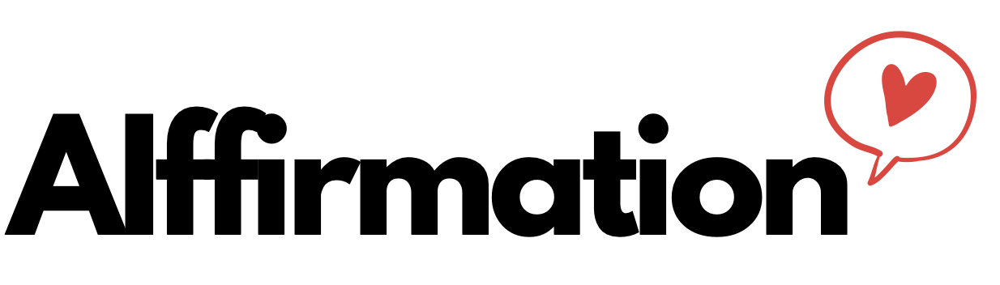

AIffirmation is an app designed to enhance the way we express love and appreciation through personalized text messages leveraging the power of AI.

The app was built for the lablab.ai Goggle Vertex AI Hackathon.

It uses a model from Google Vertex AI through LangChain and it is meant to be deployed on Streamlit. [You can see the app live here](https://aiffirmation.streamlit.app/).